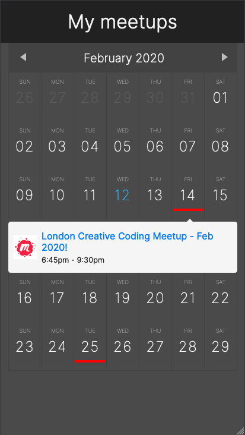

# Meetup aggregator

A calendar view of a configurable list of upcoming events from Meetup and Eventbrite.



## Configuration

Rename the file `example.properties.js` to `properties.js` and edit the list of Meetup group names and/or Eventbrite organisation IDs. If you include Eventbrite, you will also need to include your private Eventbrite API token.

```bash
class Properties {
  constructor() {
    this.groups = [
      // meetup group name
      'london-creative-coding',
      // eventbrite group id
      28052275925,
    ];
    this.eventbriteToken = 'YOUR PRIVATE TOKEN';
  }
}

export default Properties;
```

## Setup

The application uses [Parcel](https://parceljs.org/) for bundling and [yarn](https://yarnpkg.com/) for package management.

```bash
# in the project folder, install dependencies
yarn

# run in development mode
yarn dev

# run in production mode
yarn build
```
